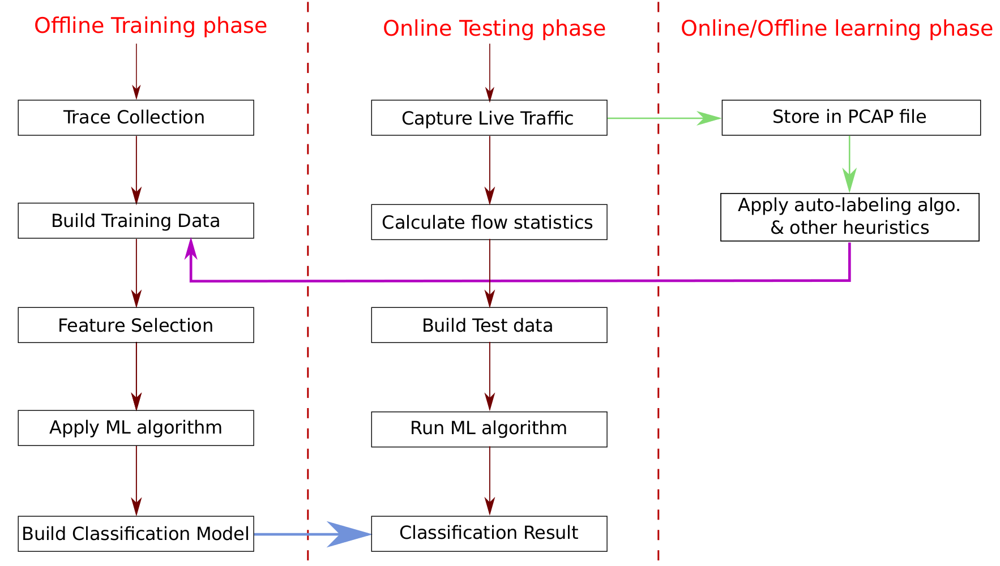
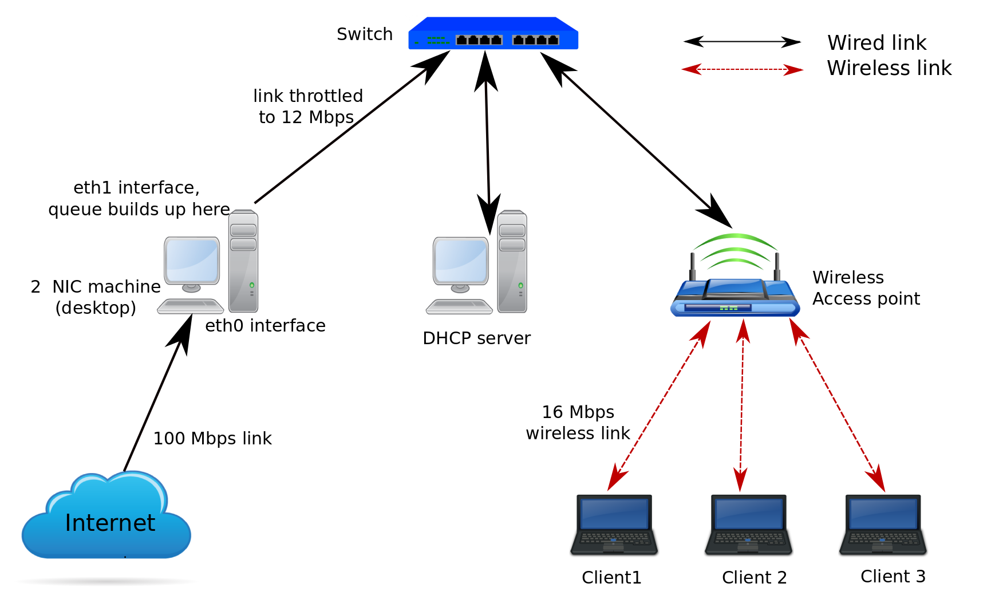
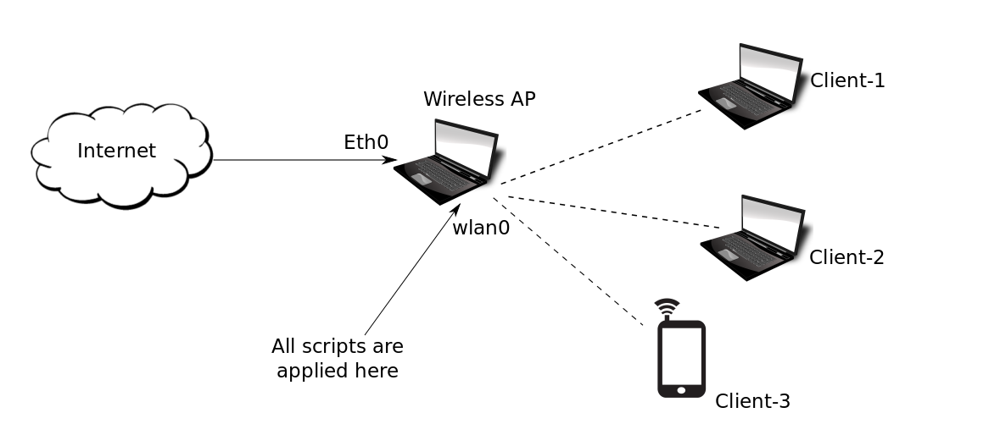

##Traffic Classification Developer's Guide

The manual contains a brief overview of the scripts. We have used bash and python scripts in this project.

## Overview of complete process

Traffic classification is basically two phase process. 
1. Trace collection and training the classifier (offline) 
2. Identify multimedia traffic using classification model (real-time)

Figure 1 shows the big picture of the whole process.

Fig. 1: Overall classification process

First we collect traces, use some labeling mechanism to label the training flows. Then we select the minimal set of features which can classify the traffic with high accuracy. 
After this, we apply different ML algorithms to train the classifier which is further used in the real-time scenario.

During real-time classification, inside an AP, traffic is captured live and then we calculate the flow related statistics (feature values) after certain pre-defined threshold point. Depending upon those feature values, the flow is classified as either multimedia or download. If it is classified as multimedia then that flow is prioritized immediately.

As the same training data might not be effective after long duration because the flow characteristics changes over the period of time, we need to update our classifier at regular intervals. To re-train the classifier, we save the traces during the real-time classification and at regular intervals we keep on adding these new flows along with their correct tags in the existing training data and re-train the classifier. Thus, the changes in the network/traffic characteristics can be reflected.

### Description of each module

Each script contains enough comments and documentation explaining the overall workflow and the relevance of every important command. So here we will briefly go through the workflow of each module. For specific details, you can read the comments in the corresponding script.

#### Module 1: 2-interface-machine-files ####
This directory contains 2 bash scripts which are executed on 2-interface machine. 
1. **nat.sh :** It is used for natting. It translates private ip to public ip for all the packets going outside of the private network, i.e. packets going to the Internet. Similarly, it translates public ip to private ip for all the packets coming from Internet. It changes the source IP of the packets going to the Internet, to its own IP address (masquerade), i.e. desktop’s eth0 IP address. 
2. **2interface.sh :** It is used to make a bridge between the two interfaces of the machine. It forwards all the packets from eth0 to eth1 interface and vice-versa.

#### Module 2: DHCP 
This module configures the dhcp server on a machine. This module consists of 3 files. 
1. **configure-dhcp-server.sh :** It makes the necessary changes in /etc/dhcp/dhcpd.conf and /etc/network/interfaces files to configure the ip-ranges and gateway etc. 
2. **interfaces :** This file contains information about the gateway, netmask and other parameters. 
3. **dhcpd.conf :** This file contains the defined ip-ranges that will be allotted by the dhcp server. You can make the necessary changes in this file as per requirement. 

#### Module 3: Label-training-data 
This module is responsible for labelling the training data (trace files in pcap format).
There are two sub directories. 

##### for-multimedia-pcaps :
It does the labeling for multimedia trace files. 
create-training-data-for-Multimedia.sh : It uses tshark command to fetch the required fields from each of the packets . It further invokes generate-list-of-port-with-GET-request.py, create-csv-with-flow-features.py and create-header.py to create a csv file which contains all the multimedia flows.
	It also takes care of all those pcaps which do not have HTTP GET requests. You can read the comments in the scripts for more details. 

		
##### for download-pcaps :
It does the labeling for download files.  
create-training-data-for-download.sh : It invokes create-csv-with-flow-features-download.py which contains manually defined threshold values for some of the feature values to filter out the download flows and put them in a csv file. You can change those threshold values as required. 

#### Module 4:Configure-Laptop-as-AP
This module consists of 3 files. 
1. **Laptop-AP :**  This file contains the configuration information of the access point that will be created. You can change the SSID,wifi security settings, etc., in this file. 
2. **make-ap.sh :** This script copies Laptop-AP file to /etc/NetworkManager/system-connections/ location and restarts network manager to create a wifi network with the SSID mentioned in Laptop-AP file. 
3. **remove-ap.sh :** It will undo the changes made by the make-ap.sh script. 

#### Module 5: DT-classification-2-interface-machine 
This module contains scripts which are applied at 2-interface machine setup (see Fig. 2). 

Fig. 2: 2-interface machine setup

This does the decision tree based classification. It has following files. 
1. **generate-decision-tree-model.sh :**   This script is used to generate decision tree model from the given training data. 
2. **create-htb-queues.sh :** This script creates 3 bands and it has some tc filter rules which forward multimedia packets to high priority band. Fig. 3 shows the HTB bands and how we use iptables rules along with tc filter rules to put the multimedia flow packets in the prioritized band. After the classification script has identified a flow as multimedia, it applies an iptables rule which marks all the packets belonging to that flow as some particular number, say 5. Now we have another tc filter rule which filters all the packets marked with number 5 and then forwards them to high priority band. Thus multimedia flows get prioritized. There are some other parameters also, such as ceil, rate, etc., that you can change as per requirement (see the comments in the script for more details).

3. **classification-script-decision-tree.py :** This script uses pcapy module to capture packet live, and process each packet one by one. (see Fig. 4) First it checks if the packet belongs to an existing flow. If NO, then it creates a new flow entry in the data structure and initializes other parameters. If that packet belongs to an existing flow, then the parameters of that flow get updated, such as packet count for the flow, inter-arrival times, etc. We maintain list of packet sizes, list of inter-arrival times and few other data structures for each flow. 

Fig. 4: Classification in live AP

Then we check if this flow has reached the threshold point (defined as some particular number of packets in a flow, in our case its first 1000 packets). If YES, then we call another function which calculates all the features values and then checks if this flow falls under multimedia class, depending on the if-else conditions, that were generated from the decision tree model. 
If the flow gets classified as multimedia, then we use iptables command to prioritize that flow using the 4-tuple information (SIP,DIP,SP,DP). We put an iptables command to mark the flow as some particular number and then there is a tc filter which filters those marked packets and put them in the prioritized band. 
4. **main-script.sh :**  This is the main script, and it invokes the above 2 scripts (Create-htb-queues.sh and classification-script-decision-tree.py). It also captures the traffic in pcap file using tcpdump and saves them locally, which will be further used to re-train the classifier. 

#### Module 6: DT-classification-on-laptop-AP 
This module is similar to module 5. The difference is that, here the classification is performed on the wlan0 interface of a laptop which is working as an AP.  In this case, we capture the packets at wlan0.(Fig. 5) 

Fig. 5: Laptop-AP setup

This module contains 3 files:  
1. create-htb-queues-laptop-AP.sh 
2. decision-tree-classification-laptop-AP.py 
3. main-script-laptop-AP.sh 

#### Module 7: KNN-classification-2-interface-machine 
This module performs K-nearest neighbor based classification. It need weka tool to classify the flow using knn model. It contains following files. 
1. **data.csv :**  This is the training file containing flows along with their feature values and label.  
2. **generate-KNN-model.sh :** This script converts data.csv to a new file train-data.arff and Then it builds KNN model using this arff file. 
3. **knn.model :**  This is the knn model which is passed to weka to predict the tag of the test flow. 
4. **test-data.arff :**  This file contains exactly one entry, .i.e., the feature values of the flow which we are going to classify. 
5. **call-weka-and-find-tag.sh :** It uses the exising KNN model (knn.model file) and the test instance (test-data.arff) and invokes KNN algorithm to predict the tag for the flow in test-data.arff. 
6. **Create-htb-queues.sh :**  This script creates 3 bands and also sets different parameters. 
7. **Knn-classification-script.py :**  This script captures packets live, calculate feature values for the flow (similar to the script in module 5). It creates the test-instance (test-data.arff file) and then invokes call-weka-and-find-tag.sh to get the predicted tag for it. It further does the prioritization if the flow is tagged as multimedia using the iptables and tc filter rules. 
8. **main-script-KNN.sh :** This script invokes create-htb-queues.sh and knn-classification-script.py . It also captures the traffic in pcap file using tcpdump and saves them locally, which will be further used to re-train the classifier. 

#### Module 8: MOS-calculation-scripts
This module is used when we want to test the quality of the multimedia streaming. MOS score is based on features such as packet loss, latency and jitter. To calculate the MOS score, first we need to capture the trace (pcap file) on the client machine, while we do the multimedia streaming.  
Now move all the pcaps to the directory MOS-calculation-scripts. You need to simply run the auto-calculate-mos.sh script.

This module has 3 files. 
1. **calculate-moss.py  :** In this script, we use equations from Pingplotter software page  (https://www.pingman.com/kb/article/how-is-mos-calculated-in-pingplotter-pro-50.html) to calculate the MOS score. 
2. **Calculate-moss.sh :** This script calculates the number of tcp retransmission, number of duplicate acks, number of lost segments and number of fast retransmission. It invokes calculate-moss.py and pass these information to calculate the MOS score. 
3. **Auto-calculate-mos.sh :** This script invokes calculate-moss.sh for each pcap file present in the current directory and finally creates a file ‘mos-scores.txt’ which contains the MOS scores of each pcap file. 

